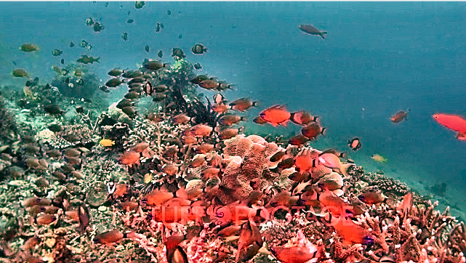
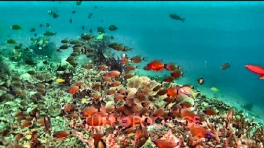
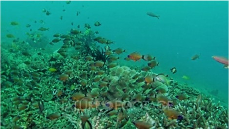
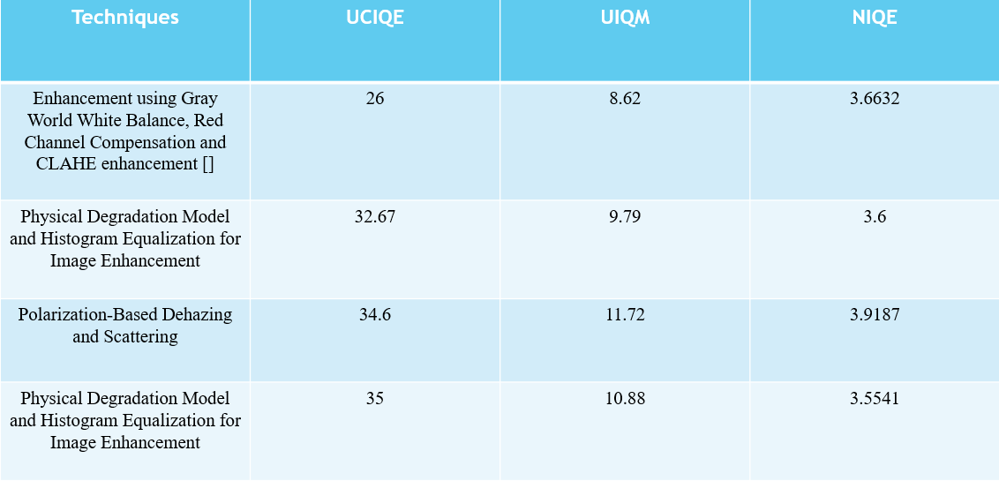

# 🌊 Underwater Object Detection and Physical Size Estimation using Computer Vision and Sonar

[](https://www.python.org/)
[](https://pytorch.org/)
[](https://github.com/ultralytics/ultralytics)
[](https://opencv.org/)
[](https://developer.nvidia.com/embedded/jetson-orin)

An end-to-end underwater computer vision framework developed for **Autonomous Underwater Vehicles (AUVs)** that performs **real-time object detection, underwater image enhancement, distance estimation, and physical size measurement**.

The system integrates a **Deepwater Explore HD Camera**, **Blue Robotics Ping Sonar**, and a **YOLOv8n object detection model** running on an **NVIDIA Jetson Orin Nano**. To improve visibility in challenging underwater environments, several enhancement techniques including **Hybrid Color Correction & Dehazing**, **Polarization-Based Dehazing**, **FUnIE-GAN**, and **CLAHE** are incorporated.

The project demonstrates how deep learning and sensor fusion can be combined to perform reliable underwater perception even in low-visibility environments.

---

# 📑 Table of Contents

* Project Overview
* Features
* System Architecture
* Hardware Used
* Software Stack
* Mathematical Model
* Directory Structure
* Installation
* Running the Project
* Underwater Enhancement Techniques
* Experimental Results
* Demo Videos
* Future Improvements
* Team
* References
* License

---

# 🚀 Project Overview

Underwater environments present several challenges for computer vision systems including:

* Poor illumination
* Color distortion
* Water turbidity
* Light scattering
* Low contrast
* Suspended particles

These issues significantly reduce the performance of conventional object detection algorithms.

This project addresses these problems through:

* Underwater image enhancement
* Real-time object detection using YOLOv8n
* Sonar-assisted distance measurement
* Physical size estimation using camera calibration and the pinhole camera model
* Deployment on NVIDIA Jetson Orin Nano for edge inference

---

# ✨ Features

* Real-time underwater object detection
* Underwater image enhancement
* Sonar-based distance estimation
* Physical size estimation of detected objects
* Camera calibration support
* Hardware deployment on Jetson Orin Nano
* Live visualization with OpenCV
* Modular architecture
* Multiple enhancement algorithms
* Sensor fusion between camera and sonar

---

# 🏗️ System Architecture

```
                 Underwater Scene
                        │
        ┌───────────────┴───────────────┐
        │                               │
        ▼                               ▼
 Explore HD Camera                Ping Sonar
        │                               │
        ▼                               ▼
 Image Enhancement              Distance Reading
        │                               │
        ▼                               │
    YOLOv8 Detection                     │
        │                               │
        └──────────────┬────────────────┘
                       ▼
         Physical Size Estimation
                       │
                       ▼
            Live Visualization Output
```

---

# ⚙️ Hardware Used

| Component                   | Description              |
| --------------------------- | ------------------------ |
| NVIDIA Jetson Orin Nano     | Edge AI Computing Device |
| Deepwater Explore HD Camera | Underwater Camera        |
| Blue Robotics Ping Sonar    | Single Beam Sonar        |
| USB TTL Adapter             | Sonar Communication      |
| Waterproof Housing          | Camera Protection        |
| Power Supply                | Jetson Power             |

---

# 💻 Software Stack

## Programming Languages

* Python

## Libraries

* OpenCV
* PyTorch
* Ultralytics YOLOv8
* NumPy
* SciPy
* Matplotlib
* PySerial
* Pillow

## Development Tools

* NVIDIA JetPack
* VS Code
* Git
* Jupyter Notebook

---

# 🧠 Object Detection Model

The project uses **YOLOv8n**, a lightweight object detection model optimized for real-time inference.

### Detection Pipeline

```
Input Frame

↓

Image Enhancement

↓

YOLOv8 Inference

↓

Bounding Boxes

↓

Object Classification

↓

Distance Estimation

↓

Physical Size Estimation

↓

Visualization
```

---

# 📸 Camera Calibration

Camera calibration is performed using OpenCV to obtain:

* Camera Intrinsic Matrix
* Distortion Coefficients
* Focal Length
* Principal Point

These calibration parameters are used for accurate physical measurements.

---

# 📐 Mathematical Model

## Underwater Refractive Pinhole Model

Since light bends while travelling from water to air, the effective focal length changes due to the refractive index of water.

[
d_{water} \approx 1.33 \times d_{air}
]

where

* (d_{air}) = calibrated focal length
* (d_{water}) = effective underwater focal length

---

## Distance Estimation

Using the pinhole camera model,

[
D=\frac{d_{water}\times W}{w}
]

Where

* D = Distance
* W = Actual object width
* w = Width of detected object in pixels

---

## Physical Size Estimation

When sonar provides the distance,

[
W=\frac{w\times D}{d_{water}}
]

Where

* W = Actual object width
* D = Sonar distance
* w = Bounding box width in pixels

---

# 🌊 Underwater Enhancement Techniques

The project evaluates multiple enhancement methods.

## 1. Hybrid Color Correction & Dehazing

Features

* Color restoration
* Contrast enhancement
* White balancing
* Visibility improvement

---

## 2. Polarization-Based Dehazing

Features

* Removes scattering
* Restores underwater visibility
* Preserves object boundaries

---

## 3. FUnIE-GAN

Features

* Deep learning enhancement
* Real-time processing
* Improved color correction
* Better visual quality

---

## 4. CLAHE

Features

* Adaptive histogram equalization
* Contrast enhancement
* Lightweight processing
* Fast execution

---

# 📂 Project Structure

```text
Underwater-Object-Detection/

│
├── config/
│   ├── camera_calibration.yaml
│   └── sonar_config.json
│
├── datasets/
│
├── models/
│   ├── yolov8n_underwater.pt
│   └── funie_gan_generator.pth
│
├── src/
│   ├── enhancement/
│   │   ├── clahe.py
│   │   ├── hybrid_dehaze.py
│   │   ├── polarization.py
│   │   └── funie_gan.py
│   │
│   ├── sensors/
│   │   ├── camera_stream.py
│   │   └── sonar_ping.py
│   │
│   ├── detection.py
│   ├── estimation.py
│   └── utils.py
│
├── results/
│   ├── images/
│   ├── videos/
│   └── graphs/
│
├── requirements.txt
├── main.py
└── README.md
```

---

# 📦 Installation

## Clone Repository

```bash
git clone https://github.com/yourusername/Underwater-Object-Detection.git
```

```bash
cd Underwater-Object-Detection
```

---

## Create Virtual Environment

Windows

```bash
python -m venv venv
```

```bash
venv\Scripts\activate
```

Linux

```bash
python3 -m venv venv
```

```bash
source venv/bin/activate
```

---

## Install Dependencies

```bash
pip install -r requirements.txt
```

---

# ▶️ Running the Project

## Start Camera

```bash
python src/sensors/camera_stream.py
```

---

## Start Sonar

```bash
python src/sensors/sonar_ping.py
```

---

## Run Detection

```bash
python main.py
```

---

# 📊 Experimental Results

## Detection Results

🎥 **Object Detection Demo**

▶️ [Watch the Object Detection Demo](images/image_detection.mp4)

---

## Image Enhancement Results

The following figure compares the original underwater image with the outputs of different enhancement techniques used in this project.


---

## Physical Size Estimation

The system estimates the physical dimensions of detected underwater objects by combining YOLOv8 bounding box measurements with sonar-based distance estimation using the underwater pinhole camera model.


---

## Performance Metrics

| Metric | Value |
|---------|-------|
| Detection Model | YOLOv8n |
| Framework | PyTorch + OpenCV |
| Hardware | NVIDIA Jetson Orin Nano |
| Distance Sensor | Blue Robotics Ping Sonar |
| Camera | Deepwater Explore HD Camera |
| Enhancement Methods | Hybrid Dehazing, Polarization, FUnIE-GAN, CLAHE |

---

# 🎥 Demo Videos

## Complete System Demonstration

▶️ [Watch Complete System Demo](images/enhancedplusdetection.mp4)

---

# 📷 Screenshots

## Hybrid Color Correction & Dehazing



---

## Polarization-Based Dehazing



---

## CLAHE



---

## Physical Size Measurement


---

## Detection Pipeline


# 🔮 Future Improvements

* Stereo vision-based depth estimation
* Multi-object tracking
* Deep SORT integration
* Instance segmentation
* Transformer-based underwater detection
* Improved sonar-camera fusion
* ROS2 integration
* SLAM support
* 3D underwater mapping
* Autonomous navigation

---

# 👥 Team

**Institution**

National Institute of Technology Silchar

---

**Project Supervisor**

Prof. Binoy Krishna Roy

---

**Team Members**

* Sohel Khowash
* Debasish Das
* Zohab Faiz

---

# 📚 References

1. Ultralytics YOLOv8 Documentation

2. OpenCV Camera Calibration Documentation

3. FUnIE-GAN: Underwater Image Enhancement using Generative Adversarial Networks

4. Blue Robotics Ping Sonar Documentation

5. NVIDIA Jetson Orin Nano Documentation

6. OpenCV Documentation

---

# 📄 License

This project is developed for academic and research purposes.

Feel free to fork, improve, and use this repository with proper attribution.

---

# ⭐ If you found this project useful, consider giving it a Star on GitHub!
